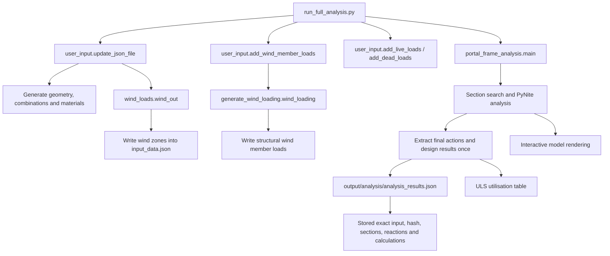
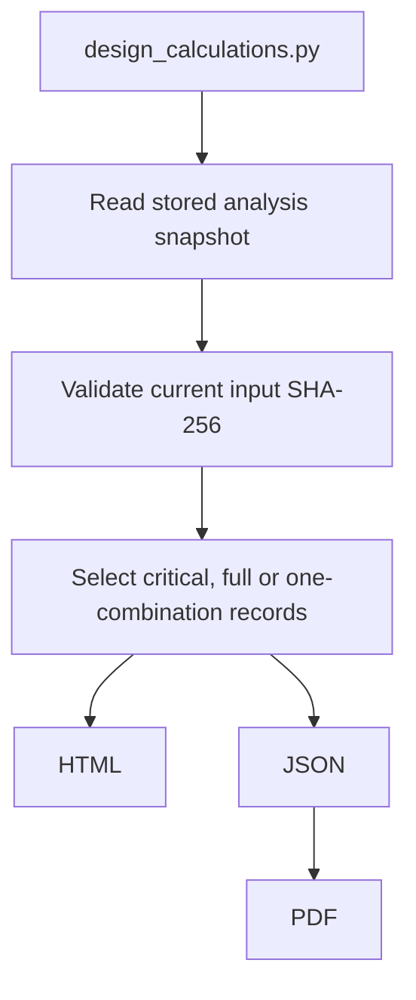

# Portal Frame Project Function and Folder Reference

This document describes the project as it exists on the `feature/calculation_sheets` branch on 2026-07-13. It is a code-navigation reference, not a substitute for an engineering design review.

## Status terminology

- **Entry point**: intended to be run directly.
- **Active**: called by a current entry point or another active function.
- **Alternative entry point**: runnable, but duplicates part of the preferred workflow.
- **Compatibility wrapper**: retained convenience function with no current production caller.
- **Test-only**: used by automated tests.
- **Legacy candidate**: no current caller and appears to have been superseded. Confirm before deletion.
- **Generated**: recreated by the application and normally not edited manually.

## Current execution paths

### Full analysis



Preferred command:

```powershell
.\.venv314\Scripts\python.exe run_full_analysis.py
```

### Calculation-sheet generation



Preferred command:

```powershell
.\.venv314\Scripts\python.exe design_calculations.py
```

The default report scope is `critical`. The other scopes are `full` and `load_combination`. Report generation does not import PyNite, search sections or analyse the frame.

```powershell
# Every stored member and load combination
.\.venv314\Scripts\python.exe design_calculations.py --scope full

# Every member and support reaction for one stored load combination
.\.venv314\Scripts\python.exe design_calculations.py --scope load_combination --load-combination "1.2 DL + 1.6 LL"
```

## Clarification about `user_input.py`

`user_input.py` is **not unused**. `run_full_analysis.py` imports the module and calls:

- `update_json_file()`
- `add_wind_member_loads()`
- `add_live_loads()`
- `add_dead_loads()`

What is duplicated is the editable input block inside `user_input.main()`. Both `run_full_analysis.main()` and `user_input.main()` define building and wind values. The preferred current entry point is `run_full_analysis.py`, while `user_input.py` remains the active geometry/load-generation library.

A future cleanup should keep the reusable functions in `user_input.py` but move the editable values into one configuration object or file. The duplicate `user_input.main()` block could then be removed.

## Folder and file structure

```text
pythonProject/
|-- run_full_analysis.py              Preferred full-analysis entry point
|-- user_input.py                     Geometry, load cases and JSON generation
|-- wind_loads.py                     Wind pressure and zone calculations
|-- generate_wind_loading.py          Converts zones into member line loads
|-- frame_model.py                    Typed in-memory input model and JSON loader
|-- portal_frame_analysis.py          PyNite model, section search and results
|-- strength_checks.py                Active steel resistance/utilisation model
|-- analysis_snapshot.py              Versioned analysis/report hand-off
|-- design_calculations.py            Stored-result filtering and exporters
|-- member_database.py                Section database loader/accessor
|-- member_database.csv               Steel section properties
|-- member_strength_checks.py         Older standalone design prototype
|-- test_wind_loading.py              Wind/load-combination regression tests
|-- test_design_calculations.py       Design/report regression tests
|-- requirements-pdf.txt              Verified ReportLab and Matplotlib PDF dependencies
|-- input_data.json                   Generated active analysis input (Git-ignored)
|-- input_data(BU).json               Tracked backup/snapshot; not read automatically
|-- output/
|   |-- analysis/                     Complete stored analysis snapshot
|   |-- calculations/                 Generated HTML and JSON calculation sheets
|   `-- pdf/                          Generated PDF calculation sheet
|-- tmp/                              Temporary renders and development artefacts
|-- Portal_Frame_Calculation_Sheet.pdf Convenience copy of generated PDF
|-- codex_fix_wind_loading_review.md  Historical review/implementation notes
|-- .venv314/                         Local Python virtual environment
|-- .idea/                            PyCharm project settings
|-- __pycache__/                      Generated Python bytecode
|-- .git/                             Git repository metadata
|-- .agents/ and .codex/              Local Codex metadata, currently empty here
`-- .gitignore                        Local Git ignore rules
```

`analysis_snapshot.py`, `PROJECT_FUNCTION_REFERENCE.md`, `output/`, `tmp/`, `Portal_Frame_Calculation_Sheet.pdf`, `requirements-pdf.txt`, and `test_design_calculations.py` are currently untracked in this working tree. Decide explicitly which generated outputs should be committed.

## Main data and unit conventions

| Data | Current convention |
|---|---|
| Geometry in `frame_data` and node coordinates | mm |
| `Member.length` | m |
| Wind geometry inside `wind_data` | m; `update_json_file()` converts selected building dimensions from mm |
| Member distributed loads passed to PyNite | kN/mm |
| Nodal forces | kN |
| Analysis moments | kN·mm internally; divided by 1,000 when reported as kNm |
| Steel strength `fy` | MPa |
| Analysis material `E`, `G` | kN/mm² numerically equivalent to GPa |
| Strength-check `E`, `G` | GPa |
| Section area `A` | 10³ mm² |
| `Ix`, `Iy` | 10⁶ mm⁴ |
| `Zex`, `Zplx`, `Zey`, `Zply` | 10³ mm³ |
| `J` | 10³ mm⁴ |
| `Cw` | 10⁹ mm⁶ |
| Section mass `m` | kg/m |

The code relies on these scaling conventions. Changing the database units without changing the conversion factors will invalidate the results.

## External dependencies

| Dependency | Used for |
|---|---|
| `numpy` | Wind interpolation and coefficient tables |
| `scipy` | `MatrixRankWarning` handling during FE analysis |
| `Pynite` / `PyNiteFEA` | Frame analysis and visualisation |
| `tabulate` | Console result tables |
| `reportlab==4.4.9` | PDF calculation-sheet export |

`requirements-pdf.txt` only covers PDF export (ReportLab and Matplotlib). There is currently no complete project dependency file for NumPy, SciPy, PyNite and Tabulate.

## Function reference

### `run_full_analysis.py`

| Function | Status and caller | Uses | Output / action | Assumptions |
|---|---|---|---|---|
| `main()` | **Entry point** | Hard-coded building/wind inputs; `user_input`; `portal_frame_analysis` | Rebuilds `input_data.json`, runs one analysis, stores `analysis_results.json`, prints results and opens the visualiser | Values are edited in this file; dimensions are entered in mm; roof type is exactly `Duo Pitched` or `Mono Pitched` |

### `analysis_snapshot.py`

| Function / class | Status and caller | Uses | Output / action | Assumptions |
|---|---|---|---|---|
| `StaleAnalysisError` | **Active exception** | Input-hash mismatch | Stops report generation by default | User can explicitly override with `--allow-stale-results` |
| `file_sha256(path)` | **Active** | Exact file bytes | Returns SHA-256 digest | Used for input and engine-source traceability |
| `_source_hashes(source_root)` | **Active helper** | Analysis source files and section database | Returns per-file hashes | Records available files; does not block later report-format changes |
| `create_analysis_snapshot(input_path, results, source_root=None)` | **Active**; `portal_frame_analysis.main()` | Exact input JSON and complete calculated results | Returns versioned, self-contained snapshot dictionary | Input must be valid UTF-8 JSON |
| `write_analysis_snapshot(snapshot, output_path)` | **Active** | Snapshot dictionary | Writes formatted snapshot JSON | Creates parent directories |
| `load_analysis_snapshot(path)` | **Active**; report generator and tests | Stored snapshot JSON | Returns validated snapshot dictionary | Rejects unsupported schema versions or missing required sections |
| `validate_snapshot_input(snapshot, allow_stale=False)` | **Active** | Stored hash and current original input file | Returns `current`, `missing`, or `stale-allowed`; otherwise raises | Missing original input is allowed because the exact input is embedded |

### `frame_model.py`

Data classes:

| Class | Purpose |
|---|---|
| `NodeLoad` | Direction, magnitude and optional load case for one node load |
| `MemberLoad` | Direction, start/end intensity, optional positions and load case for one member load |
| `Node` | Node coordinates plus attached `NodeLoad` objects |
| `Member` | Connectivity, material, type, length and attached `MemberLoad` objects |
| `PortalFrame` | Complete typed representation of the JSON input model |

| Function | Status and caller | Uses | Output / action | Assumptions |
|---|---|---|---|---|
| `load_portal_frame(path)` | **Active**; analysis and report paths | JSON file | Returns a `PortalFrame`; attaches nodal/member loads to their objects | Missing optional JSON collections become empty; loads referencing unknown nodes/members are silently skipped |

### `member_database.py`

| Function | Status and caller | Uses | Output / action | Assumptions |
|---|---|---|---|---|
| `load_member_database(filename)` | **Active** | `member_database.csv` | Returns `{'I-Sections': ..., 'H-Sections': ...}` sorted by mass | Rows 1-43 are assumed to be I-sections and all later rows H-sections; database order is therefore significant |
| `member_properties(section_type, section_choice, member_db)` | **Active** | Loaded database and exact keys | Returns the selected section-property dictionary | Raises `KeyError` for an unknown type/designation; returned dictionary is the database object, not a copy |

### `user_input.py`

| Function | Status and caller | Uses | Output / action | Assumptions |
|---|---|---|---|---|
| `generate_nodes(b_data)` | **Active**; `update_json_file()` | Geometry, roof type and bracing-spacing counts | Returns ordered node dictionaries | `col_bracing_spacing >= 1`; duo-pitch rafters use the rafter spacing count, but mono-pitch currently uses four hard-coded rafter divisions |
| `generate_supports(nodes)` | **Active** | First and last nodes | Returns two supports with translations fixed and rotations free | Bases are the first/last nodes |
| `generate_members(nodes)` | **Active** | Ordered nodes | Returns members between every consecutive node | Vertical segments are columns; all others rafters; material name is hard-coded as `Steel_S355` |
| `generate_spring_supports(nodes)` | **Active** | First and last nodes | Returns two base `RZ` springs of `10E6` | Semi-rigid base stiffness is fixed, not user-configurable |
| `generate_nodal_loads(nodes)` | **Active**, but resulting case is not in current combinations | Middle node | Returns a `-10 kN` apex load in case `CR` | No current SLS/ULS combination includes `CR`, so it does not affect the present design results |
| `steel_prop(grade)` | **Active** | `Steel_S355` or `Steel_S275` | Returns strength-check material values | Exact key required; `G=77` differs from `add_materials()` |
| `add_materials()` | **Active** | No arguments | Returns PyNite material definitions | Defines `G=80`; both grades are always returned |
| `_wind_factor(standard)` | **Active** | `Pre-2019` or `SANS 10160-1:2019` | Returns ULS wind factor `1.3` or `1.6` | Any other string raises `ValueError` |
| `_roof_accompanying_factor(accessibility)` | **Active** | Accessibility string | Returns `0.0` for `Inaccessible`, otherwise `0.3` | Any misspelling or unknown value is treated as accessible |
| `_wind_combinations(...)` | **Active** | Wind cases, accessibility and selected standard | Returns wind ULS combinations | Up/down/variable action labels determine `D_MIN`, `D_MAX` and live-load inclusion |
| `add_load_cases(...)` | **Active** | Building/roof type, accessibility and standard | Returns `(load_cases, SLS combinations, ULS combinations)` | Mixed M1/M2 cases only apply to normal duo-pitch buildings; factors are code-defined rather than user-entered |
| `add_SLS(accessibility)` | **Compatibility wrapper**; no current runtime caller | `add_load_cases()` | Returns only SLS combinations | Uses other `add_load_cases()` defaults |
| `add_ULS(accessibility, standard)` | **Compatibility wrapper**; no current runtime caller | `add_load_cases()` | Returns only ULS combinations | Uses other `add_load_cases()` defaults |
| `safe_load_json(path)` | **Active** | JSON path | Returns decoded dict, or `{}` for missing/invalid JSON | Invalid JSON is treated as an empty file rather than raising |
| `update_json_file(json_filename, b_data, wind_data)` | **Active**; full-analysis entry points and tests | All geometry/material/load-case helpers plus `wind_out()` | Rewrites core JSON collections and then calculates/writes wind zones | `wind_out()` still reads/writes the hard-coded `input_data.json`; a different filename is not fully supported |
| `add_wind_member_loads(json_filename)` | **Active** | Generated zones and `generate_wind_loading.wind_loading()` | Replaces `member_loads` with structural wind loads | Existing member loads are deliberately replaced before live/dead loads are appended |
| `add_live_loads(json_filename)` | **Active** | Rafter spacing and rafter members | Appends uniform case `L` loads to rafters | Roof live pressure is fixed at `0.25 kPa` |
| `add_dead_loads(json_filename)` | **Active** | Rafter spacing and rafter members | Appends uniform `D_MAX` and `D_MIN` loads | Pressures are fixed at `0.35 kPa` and `0.25 kPa`; its current docstring incorrectly says “live loads” |
| `main()` | **Alternative entry point** | A second hard-coded input block | Generates `input_data.json` and all member loads but does not run analysis | Duplicates values maintained in `run_full_analysis.main()` |

### `wind_loads.py`

| Function | Status and caller | Uses | Output / action | Assumptions |
|---|---|---|---|---|
| `import_data(file)` | **Active** | JSON path | Returns decoded dictionary | No schema validation |
| `normalize_wind_data(data)` | **Active** | Dict containing `wind_data` | Returns one wind dictionary | Accepts either list or dictionary form |
| `calculate_basic_wind_speed(fbs, return_period)` | **Active** | Fundamental speed and return period | Returns adjusted basic wind speed | Return period `0` returns zero |
| `calculate_terrain_roughness(apex_height, terrain_category)` | **Active** | Height in m and category A-D | Returns roughness factor | Unknown category silently defaults to A |
| `calculate_air_density(altitude)` | **Active** | Altitude in m | Returns air density | Uses the current linear approximation; altitude zero is a special case |
| `calculate_peak_wind_pressure(...)` | **Active** | Topography, speed, roughness and altitude | Returns peak pressure in kPa | Factors are multiplied directly |
| `interpolate_cpe(h_d, h_d_data, cpe_data)` | **Active** | Ratio and tabulated data | Returns clamped linear interpolation | Values outside the table are clamped |
| `interpolate_cpe_roof(...)` | **Legacy candidate**; no current caller | Roof angle and NumPy table | Returns interpolated coefficient row | Superseded by direct interpolation inside the active wind functions |
| `calculate_pressure(qp, cpe, cpi)` | **Active** | Peak pressure and coefficients | Returns `qp(cpe-cpi)` | Used for enclosed normal buildings, not canopy net coefficients |
| `wind_data_duo_n()` | **Active** via `wind_out()` | `input_data.json`, embedded normal duo-pitch coefficient tables and zone lengths | Writes 0U, 0D, M1, M2 and 90-degree zones to JSON; prints tables | Reads and writes the hard-coded `input_data.json` |
| `wind_data_mono_n()` | **Active** via `wind_out()` | Normal mono-pitch coefficient tables | Writes normal mono-pitch zones to JSON | Reads and writes the hard-coded `input_data.json` |
| `_get_blocking_factor(wind)` | **Active** | Canopy wind dictionary | Returns blocking factor clamped to 0-1 | Invalid values become zero |
| `_interp(...)` | **Active** | Canopy angle tables | Returns NumPy linear interpolation | End values are effectively clamped |
| `_interp_phi(...)` | **Active** | Open/blocked coefficients and `phi` | Returns linear blocking interpolation | Caller is expected to provide `phi` in 0-1 |
| `_wind_data_canopy(roof_type)` | **Active** | Canopy tables and `input_data.json` | Writes canopy net-pressure zones to JSON | `cp,net` is already net; internal pressure is not subtracted again |
| `wind_data_duo_c()` | **Active wrapper** | `_wind_data_canopy()` | Generates duo-pitch canopy zones | No extra logic |
| `wind_data_mono_c()` | **Active wrapper** | `_wind_data_canopy()` | Generates mono-pitch canopy zones | No extra logic |
| `print_zones(zones)` | **Legacy/debug candidate**; no current caller | Zone dictionary | Prints formatted zone lengths | Nested `fmt()` only formats output |
| `zones_normal()` | **Active** | Geometry in `input_data.json` | Returns A-J zone lengths for 0° and 90° wind | Reads the hard-coded default JSON; lengths are in m |
| `wind_out()` | **Active dispatcher** | Building type and roof type | Calls the relevant normal/canopy generator | Unsupported strings return without a result or explicit error |

### `generate_wind_loading.py`

| Function | Status and caller | Uses | Output / action | Assumptions |
|---|---|---|---|---|
| `_get_nodes(data)` | **Active** | Raw JSON nodes | Returns nodes keyed by name | Names are unique |
| `_sort_columns(members, nodes, x_pos)` | **Active** | Members and node coordinates | Returns bottom-to-top columns at one x-coordinate | Column x-coordinate must exactly equal `0` or gable width |
| `_sort_rafters(members, nodes)` | **Active** | Members and nodes | Returns rafters ordered left-to-right | Connectivity follows increasing x |
| `_zone_dict(zones)` | **Active** | Zone list | Returns zones keyed by `Zone` | Required zone names must exist |
| `_add_load(...)` | **Active** | Member, intensity, case and optional positions | Appends one local-`Fy` uniform load dictionary | Start/end positions are in mm |
| `_distribute(...)` | **Active core helper** | Length in mm and ordered member list | Splits a zone load across member boundaries; returns next `(index, position)` | Member lengths are stored in m and converted to mm |
| `_process_0deg(...)` | **Active for normal buildings** | 0° zones, columns, rafters and pitch | Appends wall and roof line loads | Structural roof zones are G/H/J/I; local zone F is excluded from the frame model |
| `_process_90deg(...)` | **Active for normal buildings** | 90° zones and rafters | Applies governing F/G/H/I roof envelope to rafters | Longitudinal wall pressure is excluded from the 2D transverse frame |
| `_process_canopy_0deg(...)` | **Legacy candidate**; no current caller | Canopy zones | Would apply zone-based roof loads | Superseded by `_process_canopy_structural()` |
| `_process_canopy_90deg(...)` | **Legacy candidate**; no current caller | Canopy zones | Would apply zone H over the roof | Superseded by `_process_canopy_structural()` |
| `_interp(...)` | **Active** | Angle and table lists | Returns clamped linear interpolation | Pure-Python canopy `cf` interpolation |
| `_cf_mono(pitch_deg, phi)` | **Active** | Mono canopy pitch/blocking | Returns `(cf_max, cf_min)` | Uses embedded SANS canopy resultant-force tables |
| `_cf_duo(pitch_deg, phi)` | **Active** | Duo canopy pitch/blocking | Returns `(cf_max, cf_min)` | Interpolates across -5°/+5° for 0° |
| `_advance_position(members, distance_mm)` | **Active** | Ordered rafters and distance | Returns member index/local position | Used to start loads at mid-roof |
| `_process_canopy_structural(...)` | **Active for canopies** | Wind data, rafters and `cf` functions | Appends resultant structural canopy loads | Uses resultant force rather than local pressure zones; duo pitch includes a one-pitch arrangement |
| `wind_loading(data=None)` | **Active public function** | Raw dict, `PortalFrame`, or default JSON | Returns the complete structural wind `member_loads` list | Only `Normal` and `Canopy` are supported; roof/member ordering must match generated geometry |

### `portal_frame_analysis.py`

| Function | Status and caller | Uses | Output / action | Assumptions |
|---|---|---|---|---|
| `_is_instability_error(exc)` | **Active** | Exception text | Returns whether an error looks like FE instability | Classification is based on words in the message |
| `import_data(file)` | **Active wrapper** | `load_portal_frame()` | Returns `PortalFrame` | No additional validation |
| `build_model(r_mem, c_mem, data)` | **Active core function** | Section dicts and `PortalFrame` | Returns a populated PyNite `FEModel3D` | 2D frame is represented in XY; self-weight is always case `D`; zero member loads are skipped; base springs come from JSON |
| `analyze_combination(args)` | **Active worker** | One rafter/column pair plus limits and data | Returns an acceptable result tuple or `None` | Rejects a rafter flange wider than column flange + 3.5 mm; non-finite results fail; all ULS checks must pass |
| `get_member_lengths(data)` | **Active** | Frame members | Returns total rafter and column lengths in m | Only types exactly `rafter` and `column` are counted |
| `directional_search(...)` | **Active** | Candidate section lists and worker count | Runs section pairs in processes and returns best-result dictionary | Uses `max(1, CPU count - 4)` workers; “rafter-first” and “column-first” currently evaluate the same Cartesian pairs in a different order |
| `sls_check(preferred_section, r_type, c_type)` | **Active** | Database and `input_data.json` | Selects lightest passing pair, prints deflections, returns frame/metadata tuple | Deflection limits are span/150 vertically and eaves height/150 horizontally; preference is an exact `Preferred` CSV flag |
| `extract_member_actions(...)` | **Active single source** | Analysed frame, one ULS combination and selected sections | Returns the final member action/effective-length dictionaries used by checks and snapshot | Compression is positive and tension negative; `Kx=1.2` columns, `Kx=1.0` rafters, `Ky=1.0`; rafter `Lx` is whole half-span/full mono span and `Ly` is each model segment |
| `internal_forces(...)` | **Active during section search** | `extract_member_actions()` and strength checks | Returns member utilisation dictionaries | Uses the same action records later stored for reporting |
| `member_design_checks(...)` | **Active** | Every ULS combination | Returns `True` only if all finite ratios are <= 1 | Any failed member rejects the section pair |
| `uls_results(...)` | **Active** | Stored final calculations, with direct-calculation fallback | Prints member/check table for every ULS combination | Main workflow passes stored records and does not recalculate them |
| `render_model(frame, combo)` | **Active** | Analysed PyNite frame and combination | Opens interactive renderer with loads, labels and deformed shape | Falls back to an analysed combination; deformation scale is fixed at 20; nested helpers validate results and read displacements; temporary name/load edits are restored |
| `main(render=True, snapshot_path=...)` | **Entry point**, also called by `run_full_analysis.py` | Section search, final action extraction, snapshot builder and optional renderer | Runs one FE analysis, writes the complete snapshot before rendering, prints stored ULS results and returns snapshot path | Assumes `input_data.json` exists and is current |

Nested functions inside `render_model()`:

| Function | Purpose |
|---|---|
| `_has_displacement_results(combo_name)` | Confirms that a named load combination exists and has stored node displacement results |
| `_get_disp(component, combo_name)` | Reads one displacement component from either mapping-style PyNite result representation, defaulting to zero when unavailable |

### `strength_checks.py`

| Function | Status and caller | Uses | Output / action | Assumptions |
|---|---|---|---|---|
| `member_class_details(Cu, member_prop, grade)` | **Active** | I-section geometry, axial force and `fy` | Returns flange/web ratios, limits, classes and governing class | Tension is excluded from the web compression ratio; formula is specific to current I-section classification model |
| `member_class_check(...)` | **Active wrapper** | `member_class_details()` | Returns only governing class number | Same assumptions as above |
| `element_property_details(Mx_max, Mx_top, Mx_bot)` | **Active** | Maximum and end moments | Returns `kappa`, `omega1`, `omega2` and audit values | `omega1=1.0` assumes transverse distributed loading; intermediate peak uses a 10% comparison tolerance |
| `element_properties(...)` | **Active wrapper** | Detailed moment-factor function | Returns `(omega1, omega2)` | Drops audit details |
| `section_properties(mb, mem, mat_prop)` | **Active core function** | Section, member actions/effective lengths, material | Returns compression, tension, Euler and moment resistances plus slenderness | Relies on the database unit scaling documented above; `Tr` is gross yielding only |
| `ltb_properties(...)` | **Active** | Section torsion/warping properties, class, `omega2`, unbraced length | Returns `Mcr`, `Mp`, `My`, `Mi`, and LTB resistance | `Kly` is used as the laterally unbraced length |
| `ltb_moment(...)` | **Compatibility wrapper**; no current repository caller | `ltb_properties()` | Returns only factored LTB moment resistance | Retained for possible external use |
| `cross_sectional_strength(...)` | **Active** | Compression member and resistances | Returns compression-bending utilisation | Uses `max(1,U1x)` and class factor `m=0.85` for classes 1-2 |
| `overall_member_strength(...)` | **Active** | Compression member and resistances | Returns overall member utilisation | Uses major-axis compressive resistance and uncapped `U1x` |
| `lateral_torsional_buckling(...)` | **Active** | Compression member and LTB resistance | Returns `(interaction, pure bending)` | Uses minor-axis compression resistance in interaction |
| `tension_and_bending(...)` | **Active for negative axial force** | Tension action and resistances | Returns additive tension/bending and LTB stress-relief checks | Negative `Cu` means tension; utilisation is prevented from becoming negative |
| `member_design(...)` | **Active dispatcher** | Section, actions and material | Returns `(CSS, OMS, LTB tuple)` | Routes negative `Cu` to tension checks, otherwise compression checks |

### `design_calculations.py`

Data structures:

| Class / enum | Purpose |
|---|---|
| `ReportScope` | `critical`, `full`, or `load_combination` report selection |
| `CalculationItem` | One auditable input, equation, substitution, result or utilisation check |
| `MemberCalculation` | Complete report record for one member and ULS combination |
| `ReactionResult` | Six reaction components at one support and combination |
| `CalculationSheetData` | Whole report model containing project, summary, members, reactions and warnings |
| `to_dict()` methods | Convert report dataclasses into serialisable dictionaries |

| Function | Status and caller | Uses | Output / action | Assumptions |
|---|---|---|---|---|
| `_check_item(...)` | **Active helper** | Equation/result data | Returns PASS/FAIL `CalculationItem` with limit 1.0 | Non-finite values fail |
| `_info_item(...)` | **Active helper** | Input/equation data | Returns informational `CalculationItem` | Result must be convertible to float |
| `calculation_sheet_from_dict(raw)` | **Active snapshot loader helper** | Stored result dictionary | Reconstructs typed calculation records | Does not run engineering calculations |
| `calculate_member_design(...)` | **Active during final analysis storage** | Active `strength_checks` results and report metadata | Returns an auditable `MemberCalculation` stored in the snapshot | Called before the snapshot is written, never during later report generation; includes gross tension yielding but not connection/net-section resistance |
| `_result_value(map, combination)` | **Active helper** | PyNite result dictionary-like object | Returns float result | Missing `.get()` falls back to index access |
| `collect_reactions(...)` | **Active** | Analysed frame and ULS names | Returns all six support reactions | PyNite moments are converted from kN·mm to kNm |
| `select_member_results(...)` | **Active** | All member records and scope | Returns scoped member records | Critical scope retains governing tension and compression for each member type, not every physical member |
| `collect_member_calculations(...)` | **Active during snapshot creation** | Actions supplied by `portal_frame_analysis.extract_member_actions()` | Returns every member/combo design record | Raises if any governing result is non-finite; does not query the FE model itself |
| `collect_deflections(...)` | **Active** | SLS combinations | Returns maximum absolute X/Y displacement and nodes per combination | Sign is discarded in summary values |
| `build_frame_summary(...)` | **Active** | Frame data, sections and results | Returns counts, lengths, mass and governing results | Steel mass includes only modeled rafter/column lengths |
| `select_reaction_results(...)` | **Active** | Reactions and report scope | Returns scoped reactions | Critical scope keeps each combination governing any of six components at each support |
| `build_calculation_sheet_data_from_frame(...)` | **Active only at the end of analysis** | Finished frame, selected sections and engine-supplied action records | Returns the complete full-scope `CalculationSheetData` saved in the snapshot | Collects results from the already analysed model; does not rebuild or reanalyse it |
| `load_calculation_sheet_data(...)` | **Active report input** | Versioned snapshot, requested scope and stale policy | Returns filtered typed report data | Validates the input hash and performs no FE or strength calculation |
| `_fmt(...)` | **Active renderer helper** | Value and precision | Returns formatted/escaped text | Booleans/strings are HTML-escaped |
| `_html_units(...)` | **Active renderer helper** | Unit string | Returns HTML units with superscripts | Handles the project’s known `10^n` unit forms |
| `_latex_group(...)` | **Active renderer helper** | LaTeX text position | Returns one balanced group and next index | Supports the limited equations generated by this module |
| `_replace_latex_group_command(...)` | **Active renderer helper** | LaTeX command/replacer | Returns transformed text | Not a general LaTeX parser |
| `_latex_to_unicode(...)` | **Active renderer helper** | Limited LaTeX string | Returns linear Unicode math for the HTML fallback | Supports only known Greek letters, fractions, roots, subscripts and superscripts |
| `_html_value(...)` | **Active renderer helper** | `CalculationItem` | Returns formatted value plus unit | Class rows are rendered as `Class n` |
| `_html_formula(...)` | **Active renderer helper** | `CalculationItem` | Returns MathJax plus Unicode fallback markup | Browser needs MathJax for fully typeset equations |
| `_html_table(...)` | **Active renderer helper** | Headers and HTML cells | Returns table HTML | Callers must escape untrusted cell text before passing it |
| `write_html_report(data, path)` | **Active exporter** | `CalculationSheetData` | Writes printable HTML | Uses MathJax from a CDN and includes a local fallback; nested table builders are local to this function |
| `write_json_data(data, path)` | **Active exporter** | `CalculationSheetData` | Writes stable JSON report data | Creates parent directories |
| `write_pdf_from_json(json_path, output_path)` | **Active exporter** | Saved report JSON, ReportLab and Matplotlib | Writes A4 PDF with typeset equations | Matplotlib mathtext renders stored LaTeX into sharp equation images; verified with ReportLab 4.4.9 and Matplotlib 3.10.8; ReportLab 5.0.0 is explicitly rejected |
| `_parse_args()` | **Active CLI helper** | Snapshot/report command-line arguments | Returns parsed report options | Default input is `output/analysis/analysis_results.json` and default scope is critical |
| `main()` | **Entry point** | Stored snapshot and CLI options | Filters stored results and writes HTML/JSON/PDF, or renders existing report JSON to PDF | Never analyses the frame; `--allow-stale-results` is an explicit safety override |

Nested rendering functions:

| Function | Parent | Purpose |
|---|---|---|
| `sub_value(match)` | `_latex_to_unicode()` | Converts a matched LaTeX subscript into supported Unicode subscript characters |
| `super_value(match)` | `_latex_to_unicode()` | Converts a matched LaTeX superscript into supported Unicode superscript characters |
| `pdf_units(units)` | `write_pdf_from_json()` | Converts known unit exponents into ReportLab superscript markup |
| `pdf_value(item)` | `write_pdf_from_json()` | Formats one result and its units for a PDF table cell |
| `pdf_formula(item)` | `write_pdf_from_json()` | Typesets stored LaTeX with Matplotlib mathtext and scales it consistently into the PDF table cell |
| `pdf_substitution(item)` | `write_pdf_from_json()` | Formats one numerical substitution for a PDF table cell |
| `footer(canvas, doc)` | `write_pdf_from_json()` | Draws the report footer and page number |

### `member_strength_checks.py`

This file is a **legacy candidate**. It is not imported by the active analysis or report pipeline. It defines global trial actions/lengths, executes a section search at module import, and prints results.

| Function | Status | Uses / output | Important assumptions |
|---|---|---|---|
| `classify_flange(...)` | Legacy | Returns text such as `Class 1` | Uses global/prototype design approach |
| `classify_web(...)` | Legacy | Returns web class text | Reads global `Cu` rather than receiving axial force |
| `calculate_css(...)` | Legacy | Mutates section dict and returns cross-sectional utilisation | Reads many global actions and lengths |
| `calculate_oms(...)` | Legacy | Returns overall utilisation | Reads global bracing/actions |
| `calculate_ltb(...)` | Legacy | Prints `Cry` and returns LTB utilisation | Has console side effects |
| `read_member_database(...)` | Legacy | Searches and returns lightest passing section | Calls all prototype checks; the file calls this function immediately at import |

Do not delete this file solely from this reference. First confirm that no external script imports it. Within this repository it has no caller and `strength_checks.py` is the active replacement.

### Automated tests

#### `test_wind_loading.py`

| Method | Purpose |
|---|---|
| `_generate(building_type, roof_type)` | Generates isolated temporary JSON/wind loads for one of four supported building/roof configurations |
| `_assert_dead_load_factors(combinations)` | Verifies uplift uses `D_MIN` and other combinations use `D_MAX` consistently |
| `test_all_supported_building_and_roof_configurations()` | Verifies cases, member assignment and canopy load placement for Normal/Canopy and Duo/Mono |
| `test_load_combination_standard_selects_wind_factor()` | Verifies Pre-2019 uses 1.3 wind and 2019 uses 1.6 while preserving other combination behaviour |

#### `test_design_calculations.py`

| Method | Purpose |
|---|---|
| `setUpClass()` | Loads one reference section/material for the test class |
| `actions(axial_force)` | Builds a reusable member-action dictionary |
| `test_gross_section_tension_resistance()` | Verifies `Tr = 0.9 A_g f_y` |
| `test_tension_is_additive_in_governing_interaction()` | Verifies axial tension increases the additive utilisation and does not create negative LTB utilisation |
| `test_report_derives_resistances_before_utilisation()` | Verifies the tension report contains resistance and check records |
| `test_compression_report_calculates_u1x_and_uses_ltb_resistance()` | Verifies reported `U1x` and LTB bending resistance |
| `test_section_class_is_fully_reproducible()` | Verifies section-class inputs and governing class appear in the report |
| `test_effective_length_and_moment_factors_are_reported()` | Verifies `K`, `kappa`, `omega1` and `omega2` report values |
| `test_report_equations_are_valid_mathtext()` | Verifies every stored tension and compression equation is accepted by the PDF math renderer |
| `test_analysis_snapshot_round_trip_feeds_report_without_analysis()` | Verifies stored input/results round-trip into typed report data without an FE model |
| `test_changed_input_rejects_stale_analysis()` | Verifies an input hash mismatch blocks reporting unless explicitly allowed |

## Current duplication and cleanup candidates

1. **Keep `user_input.py`, remove only duplicated entry configuration later.** Its reusable functions are required by `run_full_analysis.py`.
2. **Create one configuration source.** Building/wind values currently exist in both `run_full_analysis.main()` and `user_input.main()`.
3. **Review `member_strength_checks.py` for archival/removal.** It is not part of the active pipeline and has import-time execution.
4. **Review unused wrappers/helpers.** Current no-caller functions are `user_input.add_SLS`, `user_input.add_ULS`, `wind_loads.interpolate_cpe_roof`, `wind_loads.print_zones`, `generate_wind_loading._process_canopy_0deg`, and `_process_canopy_90deg`.
5. **Remove hard-coded default-file coupling.** Several wind functions always read/write `input_data.json`, even when a filename argument exists higher in the call stack.
6. **Resolve duplicated material definitions.** `steel_prop()` uses `G=77`, `add_materials()` uses `G=80`, and `generate_members()` hard-codes `Steel_S355`.
7. **Decide whether case `CR` is required.** The apex load is generated but absent from all current combinations.
8. **Consider one section-search pass.** The rafter-first and column-first searches currently evaluate the same section-pair set.
9. **Add a complete dependency file.** The current requirements file only documents PDF export.

## Recommended ownership boundaries for the future UI

| Responsibility | Module that should own it |
|---|---|
| User/configuration values | New configuration model or UI layer |
| Geometry and load-combination generation | `user_input.py` or a renamed `input_builder.py` |
| Wind pressure/zones | `wind_loads.py` |
| Mapping wind zones to structural members | `generate_wind_loading.py` |
| Typed input schema | `frame_model.py` |
| FE model and analysis | `portal_frame_analysis.py` |
| Steel design equations | `strength_checks.py` |
| Versioned analysis/report hand-off | `analysis_snapshot.py` |
| Calculation report model/export | `design_calculations.py` |

This separation will allow a UI to call stable functions without copying engineering logic into button handlers or screen code.
